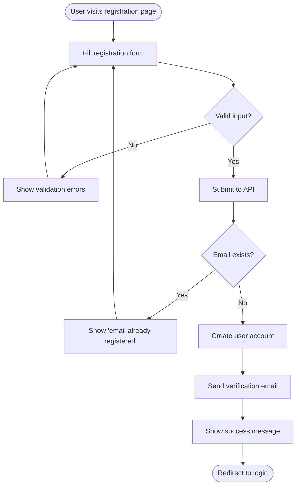
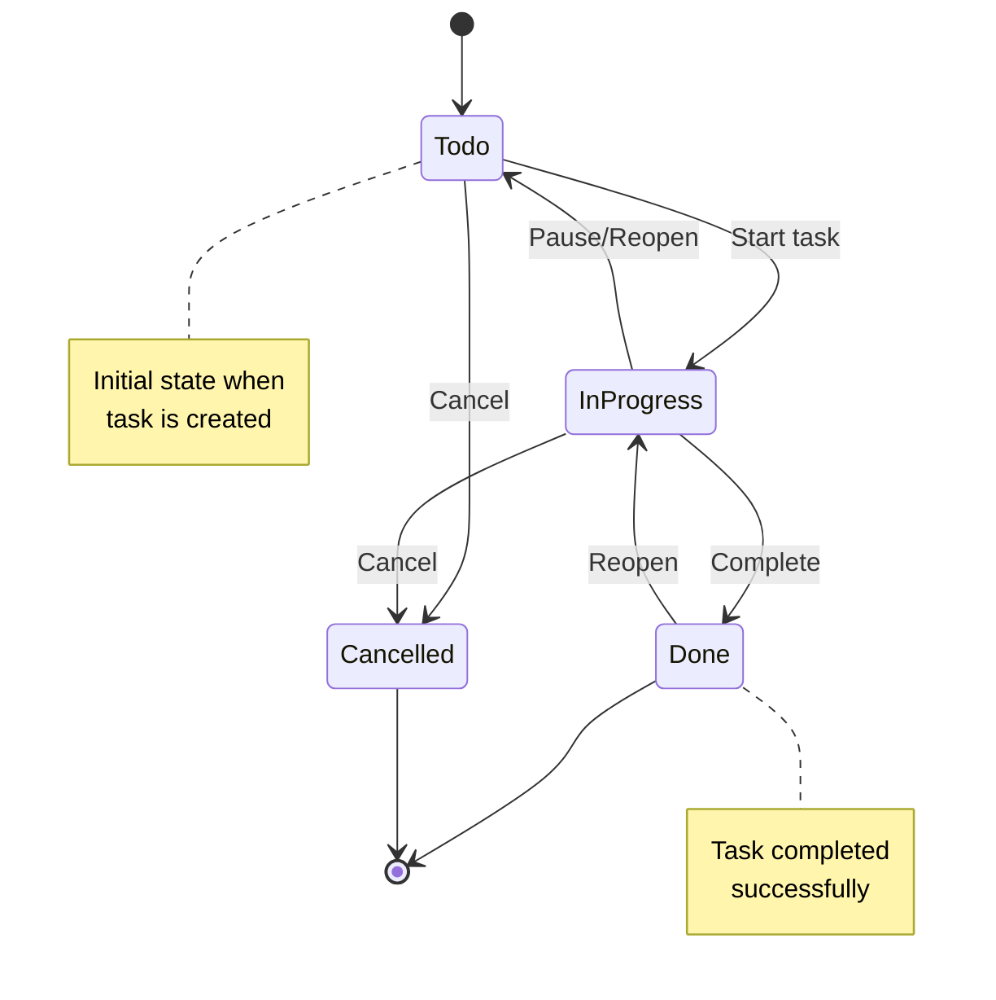
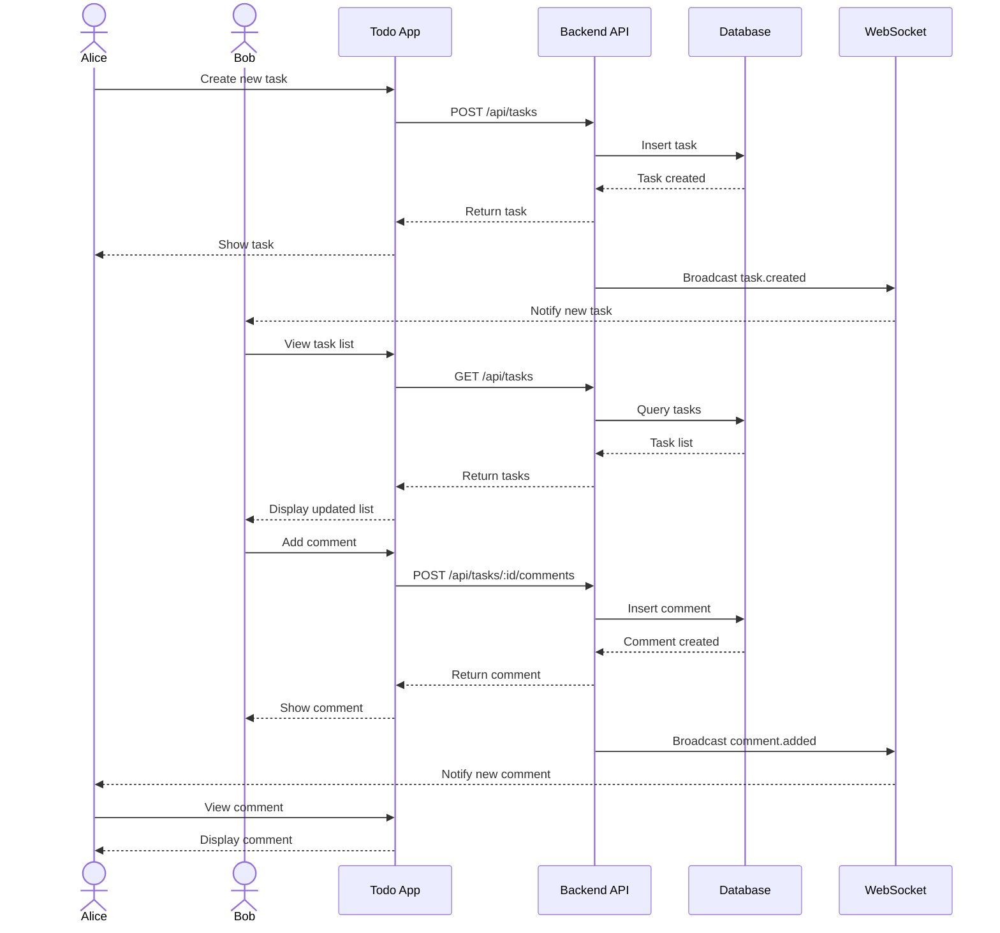
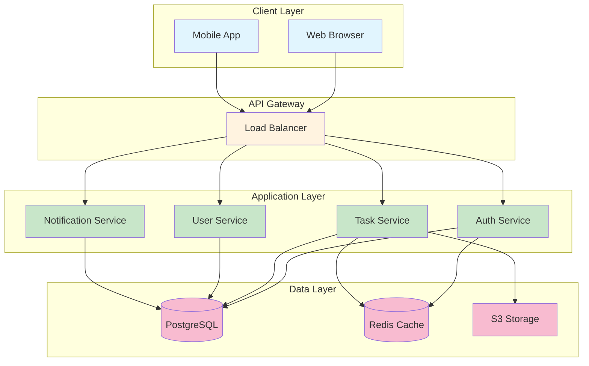
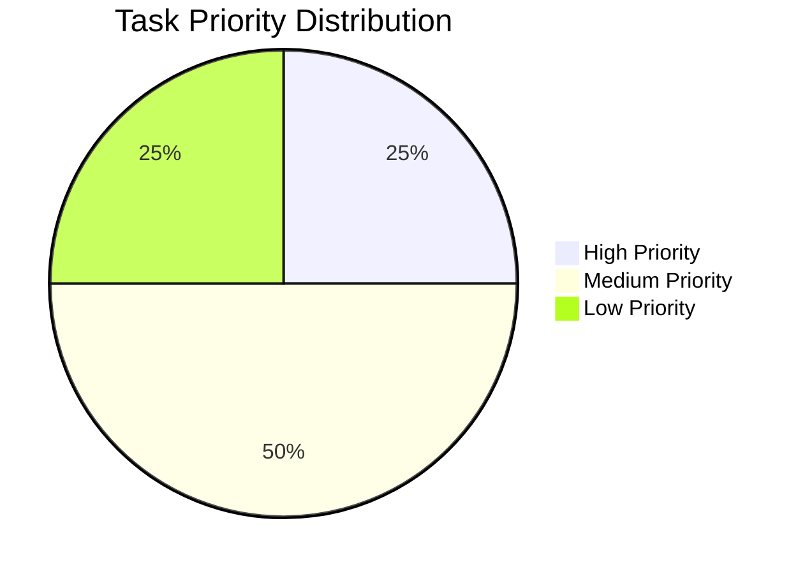
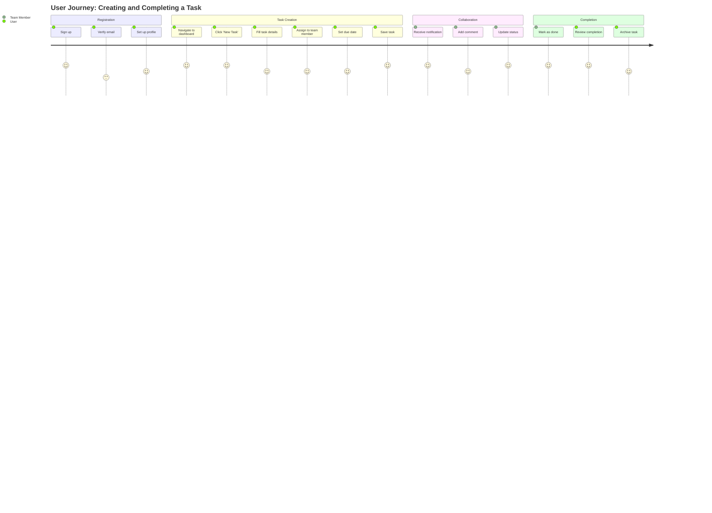

# Mermaid Diagrams - Embedded

This page demonstrates embedded Mermaid diagrams for the Multi-User Todo App workflows and state machines.

## User Registration Flow

## Task State Machine

## Team Collaboration Sequence

## Application Architecture

## Task Priority Distribution

## User Journey Map

