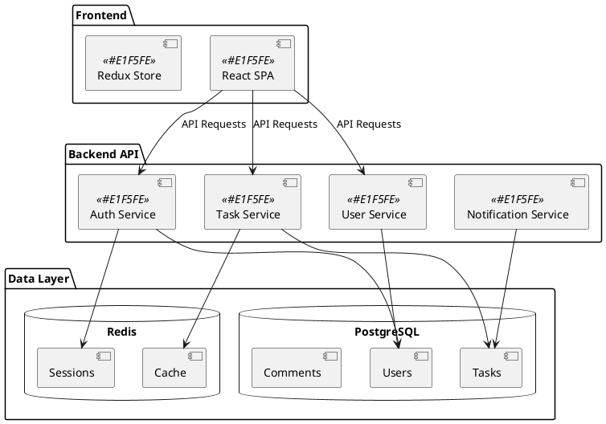
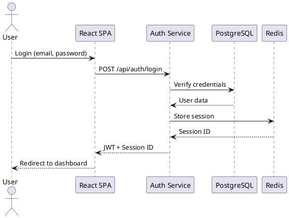
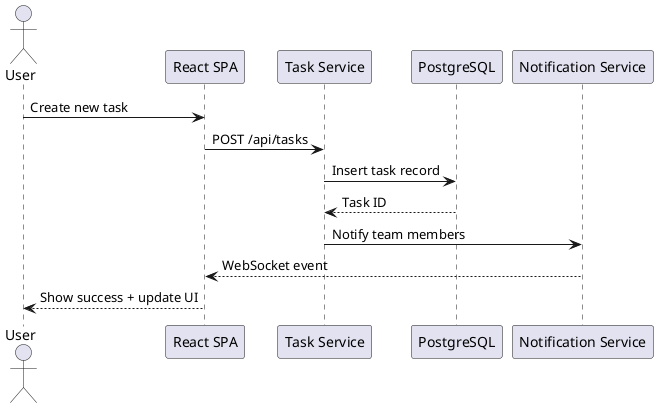
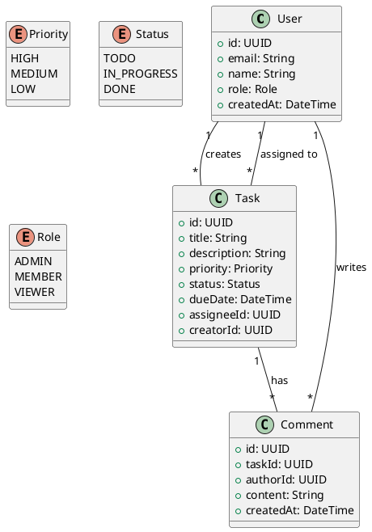

# PlantUML Diagrams - Embedded

This page demonstrates embedded PlantUML diagrams for the Multi-User Todo App architecture.

## System Architecture

## User Authentication Sequence

## Task Creation Flow

## Component Relationships

